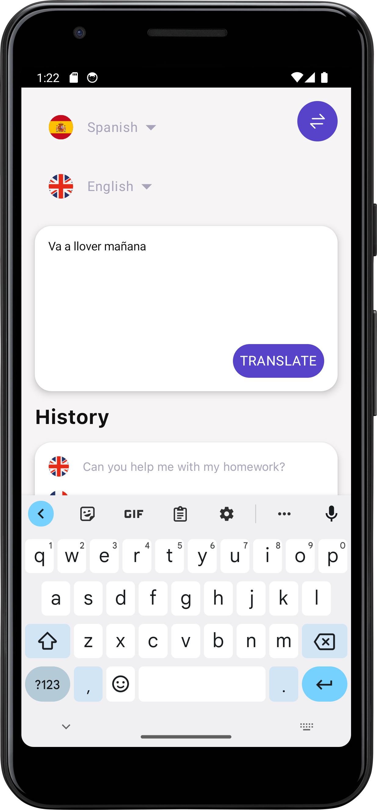
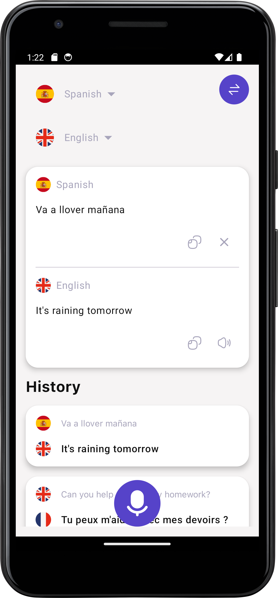
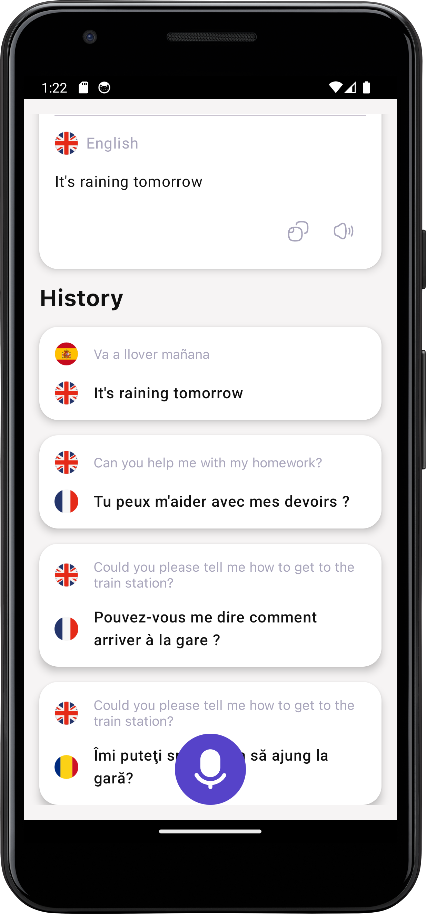
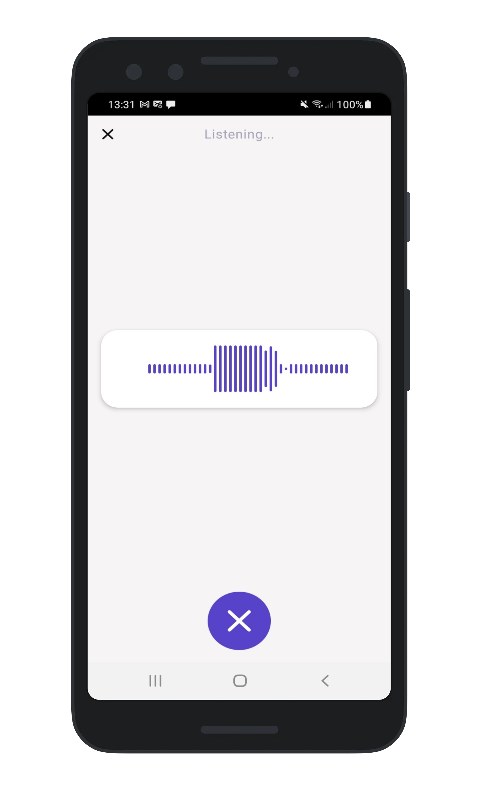
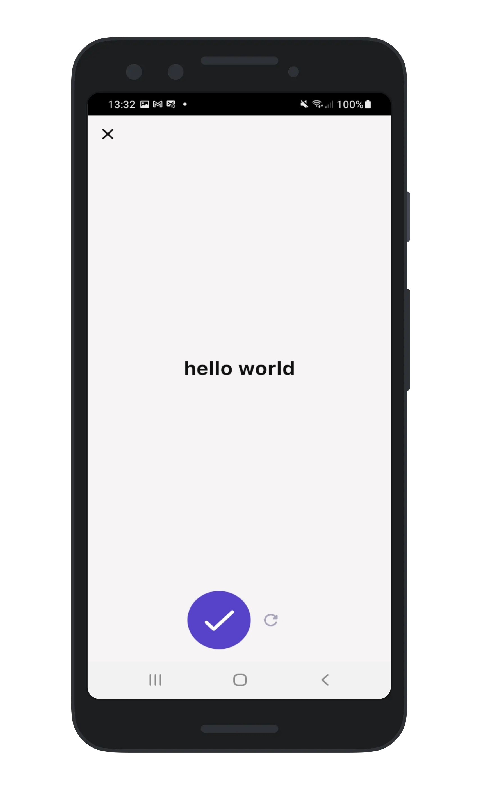

# TranslatorApp

TranslatorApp is a Kotlin Multiplatform Mobile (KMM) project designed for cross-platform mobile development, offering translation services for both Android and iOS platforms. The application follows the principles of Clean Architecture and utilizes modern technologies including:

- **Kotlin Multiplatform Mobile (KMM)**: Enables code sharing between Android and iOS platforms, reducing duplication of effort and ensuring consistency across devices.
- **Jetpack Compose (Android) / SwiftUI (iOS)**: Empowers native UI development, providing a seamless user experience tailored to each platform.
- **Ktor**: Powers networking capabilities, facilitating communication with external APIs for translation services.
- **SQLDelight**: Offers efficient data persistence, enabling storage and retrieval of translation history and user preferences.
- **Clean Architecture**: Promotes separation of concerns, with distinct layers for presentation, domain logic, and data handling, ensuring maintainability and testability of the codebase.

## Screenshots

Translate - Enter text                                    |  Translate - Translated                                    |  Translate - History
:--------------------------------------------------------:|:------------------------------------------------------:|:------------------------------------------------------:
               |         |  

Voice to Text - Listening                                 |  Voice to text - Result
:--------------------------------------------------------:|:------------------------------------:
                    |   
